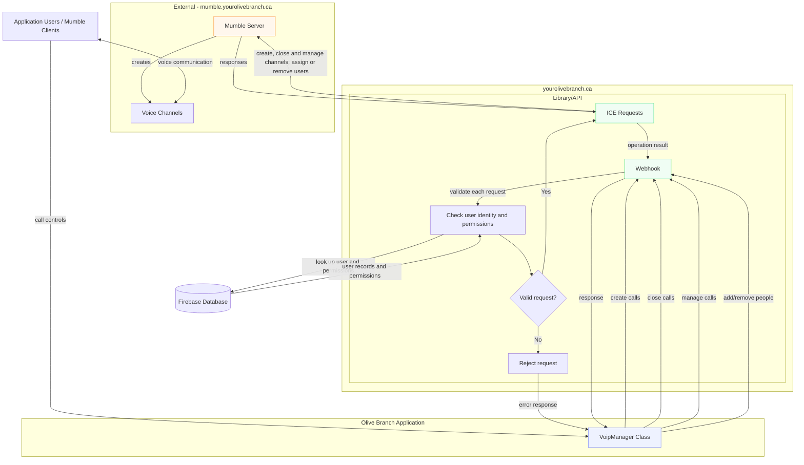

# Diagram

```mermaid
flowchart TB
    subgraph External["External - mumble.yourolivebranch.ca"]
        MumbleServer["Mumble Server"]
        Channels["Voice Channels"]
    end
    subgraph YourOliveBranch["yourolivebranch.ca"]
        subgraph LibraryAPI["Library/API"]
            Webhook["Webhook"]
            AuthCheck["Check user identity and permissions"]
            ValidRequest{"Valid request?"}
            Rejected["Reject request"]
            ICERequests["ICE Requests"]
        end
    end
    subgraph OliveBranchApp["Olive Branch Application"]
        VoipManager["VoipManager Class"]
    end
    Users["Application Users / Mumble Clients"]
    Firebase[("Firebase Database")]

    Users -- call controls --> VoipManager
    VoipManager -- create calls --> Webhook
    VoipManager -- close calls --> Webhook
    VoipManager -- manage calls --> Webhook
    VoipManager -- "add/remove people" --> Webhook
    Webhook -- validate each request --> AuthCheck
    AuthCheck -- look up user and permissions --> Firebase
    Firebase -- user records and permissions --> AuthCheck
    AuthCheck --> ValidRequest
    ValidRequest -- Yes --> ICERequests
    ValidRequest -- No --> Rejected
    Rejected -- error response --> VoipManager
    ICERequests -- "create, close and manage channels; assign or remove users" --> MumbleServer
    MumbleServer -- responses --> ICERequests
    ICERequests -- operation result --> Webhook
    Webhook -- response --> VoipManager
    MumbleServer -- creates --> Channels
    Users <-->|voice communication| Channels

    MumbleServer:::external
    Webhook:::library
    ICERequests:::library
    VoipManager:::manager
    classDef external fill:#fff7ed,stroke:#fb923c
    classDef library fill:#f0fdf4,stroke:#4ade80
    classDef manager fill:#eef2ff,stroke:#818cf8
    classDef webhook fill:#f0f9ff,stroke:#38bdf8
```
